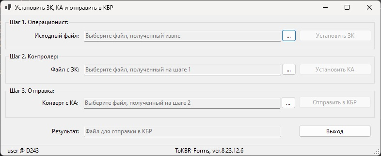

# Ufebs-N

Нормализация XML и установка ЗК/КА в документы УФЭБС перед передачей КБР-Н.

Если СКАД "Сигнатура" у вас не установлена, то для демонстрации действия
вместо байт в Base64 будет подставляться соответствующая строка "DEMO-SIGN".

## GUI Settings / Настройки программы с GUI

В файле `ToKBR-Forms.config.json`:

* `"IN": "."` - 
папка для исходных файлов `*.xml`, получаемых извне;
* `"ZK": "1ZK"` - 
папка результатов Операциониста - с установленным ЗК
(эти файлы и в Backup идут);
* `"KA": "2KA"` - 
папка результатов Контролера - с установленным КА
(эти файлы и отправляются в КБР);
* `"OUT": "3Out"` - 
папка для автоматической отправки в КБР-Н
(папка `X:\\Cli` - КБР оттуда удалит!);
* `"Backup": "Backup"` - 
папка для накопления прошедших файлов (исходные файлы с установленным ЗК);
* `"Temp": "Temp"` - 
папка для промежуточных файлов (нормализованные xml, двоичные подписи p7d);
* `"Delete": true|false` - 
удалять ли все исходные и промежуточные файлы
(входная папка очищается также! остаются только в папках Backup и KBR);
* `"OPR": "*"` - 
массив допущенных пользователей/компьютеров к операциям шага 1 (* - все);
* `"CTR": "*"` - 
массив допущенных пользователей/компьютеров к операциям шага 2 (* - все);
* `"KBR": "*"` - 
массив допущенных пользователей/компьютеров к операциям шага 3 (* - все).

## CLI / Утилита командной строки

    tokbr file.xml
    tokbr file.zk.xml
    tokbr file.zk.ka.xml

Опциональный параметр `-delete` - удалить все промежуточные файлы.

## Requirements / Требования

- .NET 8 Desktop Runtime

## License / Лицензия

Licensed under the [Apache License, Version 2.0].

[Apache License, Version 2.0]: LICENSE
